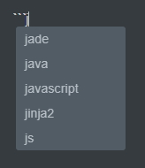

# Markdown

Как да напишем readme.md 


Заглавие

​	Пред заглавието сложи # и празно пространство

Блок за код на JS





```javascript
let blockOfCode = " ```JavaScript "
// За Typora 
// Написвате обратен апостроф, който се удебелява и дописвате j , появява се избор, избирате! 

// За Markdown
​```javascript
let blockOfCode = " ```JavaScript "
​```
```


Таблица

```
Markdown | Доста | Грубо
--- | --- | ---
*Но* | `работи` | **чудно**
1 | 2 | 3
```

Markdown | Доста | Грубо
--- | --- | ---
*Но* | `работи` | **чудно**
1 | 2 | 3


Списък  

[Емоджита](https://emojipedia.org/objects/)  
[🦠](https://emojipedia.org/microbe/)  
🦠🦠  
🦠🦠🦠  
🦠🦠🦠🦠  
🦠🦠🦠🦠🦠  
🦠🦠🦠🦠🦠🦠  
[🧫](https://emojipedia.org/petri-dish/)  

[Линк](https://github.com/vvpetkov/Markdown.git)  
